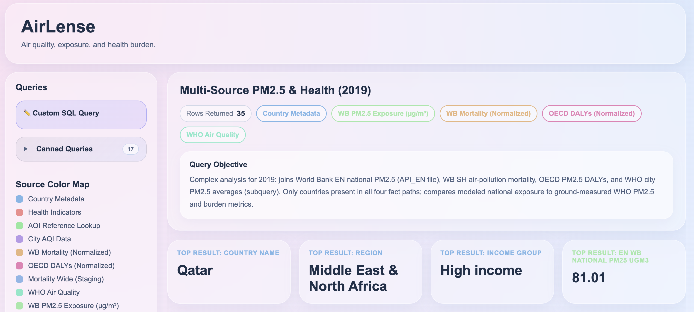

# AirLense

**AirLense** is a full-stack web app that loads **World Bank**, **OECD**, **WHO**, and **city AQI** data into a **BCNF-normalized** MySQL schema and exposes **16 canned analytical queries** (including **CTEs**, **window functions** (`ROW_NUMBER`), **self-joins**, and a **multi-source** join) plus a **read-only custom SQL** editor. **MySQL 8.0+** recommended for **Q14–Q15** (windows + CTEs); **Q16** runs on **5.7+** (self-join only).



---

## Table of Contents

- [Quick Start](#quick-start)
- [Prerequisites](#prerequisites)
- [Project Structure](#project-structure)
- [Data Sources](#data-sources)
- [Database Schema](#database-schema)
- [ETL Pipeline](#etl-pipeline)
- [Backend API](#backend-api)
- [Frontend](#frontend)
- [Canned Queries](#canned-queries)
- [Custom SQL](#custom-sql)
- [Troubleshooting](#troubleshooting) · [Detailed guide](docs/TROUBLESHOOTING.md)
- [Data sources report](docs/DATA_SOURCES_REPORT.md) — SH vs WHO vs EN, redundancy, joins
- [Normalization proof (NF1–BCNF)](docs/NORMALIZATION_PROOF.md) — per-table FDs
- [Assignment: three data aspects](docs/ASSIGNMENT_THREE_ASPECTS.md) — burden vs exposure vs subnational air quality

---

## Quick Start

```bash
# 1. Python ETL — raw CSVs in data/ → clean_data/*.csv
pip3 install -r requirements.txt
python3 transformData.py

# 2. MySQL — create DB and load (from project root; needs --local-infile)
mysql -u root -p --local-infile=1 < schema.sql

# 3. Backend (Terminal 1)
cd Backend
cp .env.example .env   # edit DB_USER, DB_PASSWORD (database is always air_pollution)
npm install
npm start
# API → http://localhost:3000

# 4. Frontend (Terminal 2)
cd Frontend
npm install
npm start
# App → http://localhost:3001 (PORT set in Frontend/package.json to avoid clashing with API)
```

Open **http://localhost:3001** in your browser.

**Windows:** if `PORT=3001` in `npm start` fails, run `cd Frontend` then `set PORT=3001&&npm start`, or install `cross-env` and adjust the script in `Frontend/package.json`.

---

## Prerequisites

| Tool | Version | Purpose |
|------|---------|---------|
| **Node.js** | v18+ | Backend + React |
| **npm** | v9+ | Packages |
| **MySQL** | 8.0+ | Database |
| **Python** | 3.8+ | `transformData.py` |

---

## Project Structure

```
airlense/   # project root (clone path may differ)
├── Backend/
│   ├── server.js           # Express API — canned queries + POST /api/custom-query
│   ├── package.json
│   └── .env.example        # Copy to .env for DB credentials
├── Frontend/               # React app (Create React App)
│   ├── src/
│   │   ├── App.js          # Dashboard UI, charts, custom SQL tab
│   │   ├── App.css
│   │   ├── index.js
│   │   └── index.css
│   ├── public/
│   │   └── index.html
│   └── package.json        # react-scripts; PORT=3001 on start
├── data/                   # Raw inputs (not committed if large — add as needed)
├── clean_data/             # Generated by transformData.py (CSV loads for MySQL)
├── transformData.py        # ETL: data/ → clean_data/
├── schema.sql              # DDL + LOAD DATA for all tables + health_impacts VIEW
├── requirements.txt        # pandas, numpy
└── README.md
```

### Raw files expected under `data/` (see `transformData.py`)

| File | Role |
|------|------|
| `Metadata_Country_API_SH.STA.AIRP.P5_DS2_en_csv_v2_6093.csv` | Country metadata |
| `API_SH.STA.AIRP.P5_DS2_en_csv_v2_6093.csv` | World Bank mortality (wide years) |
| `OECD.ENV.EPI,DSD_EXP_MORSC@DF_EXP_MORSC,1.0+.A.DALY.10P3HB.PM_2_5_OUT._T._T.csv` | OECD DALYs |
| `AQI and Lat Long of Countries.csv` | City AQI |
| `who_ambient_air_quality_database_version_2023_(v6.0).xlsx - Update 2023 (V6.0).csv` | WHO stations |
| `API_EN.ATM.PM25.MC.M3_DS2_en_csv_v2_316.csv` | PM2.5 exposure (World Bank) |
| Plus metadata CSVs for PM2.5 API | As referenced in script |

---

## Data Sources

**Written report:** [docs/DATA_SOURCES_REPORT.md](docs/DATA_SOURCES_REPORT.md) — explains how **World Bank SH (mortality)**, **EN (PM2.5 exposure)**, **WHO concentrations**, **city AQI**, and **OECD DALYs** differ, what is redundant (`mortality_wide_raw` vs normalized), and suggested join patterns.

**Normalization:** [docs/NORMALIZATION_PROOF.md](docs/NORMALIZATION_PROOF.md) — formal **1NF, 2NF, 3NF, BCNF** justification for the normalized base tables (+ view).

| Source | Content |
|--------|---------|
| **World Bank** | Country metadata; air-pollution mortality (`SH.STA.AIRP.P5`); mean PM2.5 exposure (`EN.ATM.PM25.MC.M3`) |
| **OECD** | DALYs from outdoor PM2.5 exposure |
| **AQI dataset** | City-level AQI and pollutant sub-indices with coordinates |
| **WHO** | Ambient air quality (PM2.5, PM10, NO2) by city/year |

---

## Database Schema

**9 tables** (BCNF core + optional wide staging) **+ 1 VIEW** `health_impacts` (unions World Bank mortality rows with OECD rows). See [docs/NORMALIZATION_PROOF.md](docs/NORMALIZATION_PROOF.md) for NF1–BCNF proofs.

| Table | Primary key | Notes |
|-------|-------------|--------|
| `country` | `country_code` | Region, income, `table_name` (display name) |
| `indicator` | `indicator_code` | WB / OECD / PM2.5 indicator definitions |
| `aqi_reference` | `category_name` | AQI category bounds |
| `city_aqi` | `(country_code, city, lat, lng)` | Join `country` on `country_code` |
| `mortality_normalized` | `(country_code, indicator_code, year)` | Unpivoted WB mortality |
| `oecd_normalized` | `(country_code, year)` | Columns: `obs_value` |
| `who_air_quality` | `(country_code, city, year, latitude, longitude)` | Concentrations µg/m³ |
| `pm25_exposure_normalized` | `(country_code, year, indicator_code)` | National mean exposure |
| `mortality_wide_raw` | `(country_code, indicator_code)` | **Staging only** — wide years (not 1NF) |
| `health_impacts` | — (VIEW) | `mortality_normalized` ∪ OECD as `DALY_PM25` |

`mortality_wide_raw` duplicates mortality in wide form for tooling; prefer `mortality_normalized` for analytics.

**MySQL database name:** `air_pollution` (created by `schema.sql`). The API **always** connects to `air_pollution`; `DB_NAME` / `MYSQL_DATABASE` in `.env` are ignored so they can’t point at the wrong database.

### MySQL: `LOAD DATA` and `local_infile`

```bash
mysql -u root -p --local-infile=1 < schema.sql
```

If the server rejects local infile:

```sql
SET GLOBAL local_infile = 1;
```

---

## ETL Pipeline

```bash
python3 transformData.py
```

Writes **9 CSVs** into `clean_data/` (including `mortality_wide_raw.csv`). Then run `schema.sql` as above.

Paths are relative to the project root (`data/`, `clean_data/`).

---

## Backend API

| | |
|--|--|
| **Root** | `Backend/server.js` |
| **Port** | `3000` (or `PORT` in `.env`) |
| **Config** | `Backend/.env` — `DB_*` **or** `MYSQL_*` for host/user/password/port (`MYSQL_DATABASE` ignored; DB is always `air_pollution`) |

### Endpoints

| Method | Path | Description |
|--------|------|-------------|
| GET | `/api/health` | API + MySQL ping (`database: true/false`) |
| GET | `/api/source-legend` | Colors / labels per table |
| GET | `/api/query-catalog` | 16 canned query definitions |
| GET | `/api/global-health-snapshot` | Q1 — WB mortality 2019 |
| GET | `/api/oecd-dalys-income` | Q2 — OECD by income group |
| GET | `/api/hazardous-cities` | Q3 — Hazardous PM2.5 AQI |
| GET | `/api/regional-hotspots` | Q4 — Unhealthy+ cities by region |
| GET | `/api/safest-high-income` | Q5 — Good AQI in high-income |
| GET | `/api/dual-source` | Q6 — WB + OECD 2019 |
| GET | `/api/city-vs-national` | Q7 — City AQI vs national mortality |
| GET | `/api/who-vs-mortality` | Q8 — WHO PM2.5 vs WB mortality |
| GET | `/api/who-regional-pm25` | Q9 — WHO aggregates by region |
| GET | `/api/category-aggregator` | Q10 — AQI categories in Sub-Saharan Africa |
| GET | `/api/wb-pm25-by-region` | Q11 — WB mean PM2.5 exposure by region (latest year, `API_EN…` / `pm25_exposure_normalized`) |
| GET | `/api/wb-pm25-vs-mortality` | Q12 — WB PM2.5 exposure vs air-pollution mortality (2019) |
| GET | `/api/multi-source-pm25-health-2019` | Q13 — **Complex JOIN**: EN national PM2.5 + WHO city PM2.5 + SH mortality + OECD DALY (2019) |
| GET | `/api/top-cities-per-region-aqi` | Q14 — **CTE + `ROW_NUMBER()`**: top 3 cities by AQI per world region |
| GET | `/api/wb-pm25-above-regional-average-2019` | Q15 — **CTE**: countries whose WB EN PM2.5 (2019) exceeds their region’s mean |
| GET | `/api/oecd-daly-yoy-2018-2019` | Q16 — **Self-join** `oecd_normalized`: DALY **change from 2018 to 2019** (largest \|Δ\|; WB SH extract here is 2019-only) |
| GET | `/api/mortality-yoy-change-2018-2019` | **Deprecated alias** — same handler as Q16 (old path; use `/api/oecd-daly-yoy-2018-2019`) |
| POST | `/api/custom-query` | `SELECT` only; `LIMIT 200` if omitted |

### Custom query (example)

```bash
curl -X POST http://localhost:3000/api/custom-query \
  -H "Content-Type: application/json" \
  -d '{"sql": "SELECT * FROM country WHERE region = '\''South Asia'\'' LIMIT 10"}'
```

---

## Frontend

| | |
|--|--|
| **Folder** | `Frontend/` |
| **Entry** | `Frontend/src/App.js`, `Frontend/src/App.css` |
| **URL** | `http://localhost:3001` (`PORT` in `Frontend/package.json`) |
| **API** | `http://localhost:3000/api` (see `API_BASE` in `Frontend/src/App.js`) |

**Stack:** React 18, Recharts, glass-style CSS.

**Features:** Sidebar with canned queries (collapsible) + custom SQL tab, source-colored charts and tables, typing effect on descriptions.

---

## Canned Queries

The sidebar / **`/api/query-catalog`** order is **complex → simpler**: multi-source joins, CTEs, and window functions first; straightforward joins and lookups last.

Queries join on **`country_code`** where applicable. `city_aqi` does **not** store a redundant country name column — use `JOIN country c ON city_aqi.country_code = c.country_code` and `c.table_name` for labels.

| # | Theme |
|---|--------|
| Q1–Q4 | Global mortality, OECD by income, hazardous cities, regional hotspots |
| Q5–Q7 | Safest cities, dual-source WB+OECD, city vs national |
| Q8–Q10 | WHO vs mortality, WHO by region, SSA AQI categories |
| Q11–Q12 | World Bank **EN.ATM.PM25.MC.M3** national exposure: by region; exposure vs mortality (2019) |
| Q13 | **Multi-source (2019):** `pm25_exposure_normalized` + `mortality_normalized` + `oecd_normalized` + WHO city aggregate — compare national EN PM2.5 to WHO urban PM2.5 and burden metrics |
| Q14–Q15 | **MySQL 8+:** `ROW_NUMBER` (Q14) and `WITH` CTE (Q15) |
| Q16 | OECD DALY **change from 2018 to 2019** via **self-join** (MySQL 5.7+); WB SH file in `data/` only has **2019** filled for this indicator |

---

## Custom SQL

- Only **`SELECT`** (writes blocked server-side).
- **`LIMIT 200`** appended if missing.
- Example:

```sql
SELECT c.table_name AS country, a.city, a.aqi_value, a.pm25_aqi_value
FROM city_aqi a
JOIN country c ON a.country_code = c.country_code
ORDER BY a.aqi_value DESC
LIMIT 10;
```

---

## Troubleshooting

| Issue | What to try |
|-------|-------------|
| `ECONNREFUSED` / fetch failed / “Failed to fetch query results” | Start API: `cd Backend && npm start`. If the UI shows **`API 500: …`**, fix MySQL (`schema.sql` loaded, `Backend/.env` credentials). If backend uses another port, set `REACT_APP_API_ORIGIN` in `Frontend/.env` and restart `npm start`. |
| Port clash | Backend `3000`, frontend `3001`; edit `Frontend/package.json` or `Frontend/src/App.js` (`API_BASE`) if you remap |
| `Cannot find module` / wrong directory | Run `npm install` and `npm start` from **`Frontend/`**, not the repo root |
| `ER_NO_SUCH_TABLE` | Run `schema.sql` after `transformData.py` |
| Empty tables | Run `python3 transformData.py`, then reload SQL |
| `local_infile` denied | `mysql --local-infile=1` or `SET GLOBAL local_infile = 1` |
| Wrong DB password | Edit `Backend/.env` (from `.env.example`) |
| Custom query rejected | Only `SELECT`; no DDL/DML |

---

## Technologies

| Layer | Stack |
|-------|--------|
| Frontend | React 18, Recharts |
| Backend | Node.js, Express, mysql2, cors, dotenv |
| Database | MySQL 8+ |
| ETL | Python 3, pandas |

---

## Authors

Rojin Ziaei  
Mahsa Khoshnoodi  
Georgetown University
